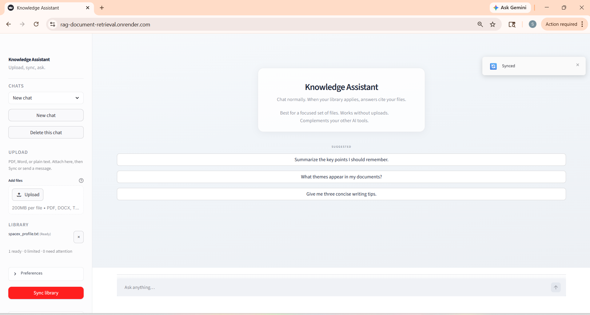

# Knowledge Assistant

**Author / maintainer:** Sai Kiran

Document-grounded Q&A with explicit routing: answers **cite your PDFs, Word docs, and text files** when retrieval and file health are strong enough, and fall back to **general** replies (without fake citations) when the library is empty, sync fails, or evidence is weak.

**Stack:** Python · OpenAI (embeddings + chat) · LangChain · **FAISS** · **BM25 hybrid** · **Streamlit** · **FastAPI** · **Next.js** (TypeScript) · SQLite · Docker

**Live Demo:** https://rag-document-retrieval.onrender.com/

**Docs:** [Deployment](DEPLOYMENT.md) · [Eval harness](eval/README.md) · [Screenshot assets](docs/images/README.md)

---

## Overview

One shared **`app/`** domain layer powers a **Streamlit** workspace and a **FastAPI + Next.js** client. Frontends stay thin: retrieval, trust gates, and generation live in Python, not duplicated in the browser.

---

## How it works

1. **Upload** → files land under `data/raw/` (typed paths, size limits on the API).
2. **Sync** → parse → normalize → **chunk** → **embed** (disk cache) → **FAISS** on disk → manifest + optional retrieval self-probe.
3. **Chat** → query rewrite when needed → **hybrid retrieve** (vector + BM25, RRF) → rerank → **trust filter** → **grounding gates** → one LLM call (**grounded** with `[SOURCE n]`, or **general** / **web** / **blended**).

---

## Features

| Area | Details |
|------|---------|
| **Retrieval** | FAISS + **BM25** fused with **RRF**; optional in-process caches for repeat queries (invalidated on index rebuild). |
| **Indexing** | **Content-hash** incremental rebuild: unchanged files can reuse chunks when settings match saved state. |
| **Answer modes** | **Grounded**, **general**, **web**, **blended**; routing from library state, retrieval strength, and query shape. |
| **Trust** | Per-file manifest (`ready` / `ready_limited` / `failed` / …); hits filtered; calibrated gates for broad vs narrow questions (regression-tested). |
| **Tasks** | **Summarize**, **Extract**, **Compare** over retrieved context. |
| **UIs** | **Streamlit:** upload, sync, sources and excerpts, optional debug. **Next.js:** sidebar (chats, library, sync), stop / new chat / clear, streaming, source snippets. |
| **Ingestion** | PDF (pdfplumber + **pypdf** fallback), DOCX (body + tables in order), TXT; optional OCR off by default (`RAG_ENABLE_PDF_OCR`, see `.env.example`). |
| **Quality** | Gold **document QA eval** (`scripts/run_document_qa_eval.py`): routing, anchors, refusals, citation surface checks. |

---

## Architecture

```text
                    ┌──────────────────┐
                    │   Next.js (web)  │
                    │  SSE + REST      │
                    └────────┬─────────┘
                             │ HTTP
                    ┌────────▼─────────┐
                    │ FastAPI (backend)│
                    │ /api/v1/*        │
                    └────────┬─────────┘
                             │ imports
┌────────────────┐   ┌───────▼────────────────────────────────────────┐
│ streamlit_app  │──►│  app/                                             │
│ (UI only)      │   │  services/   chat, index, upload, doc_task, …   │
└────────────────┘   │  llm/        generator, validation, intent     │
                     │  retrieval/  FAISS, hybrid, context selection     │
                     │  persistence/ manifest, chat_store, library state │
                     │  ingestion/  loader (PDF, DOCX, TXT)            │
                     │  utils/      chunker                            │
                     └──────────────────────────────────────────────────┘
                                         │
                              data/raw/  │  data/indexes/ (FAISS + manifest)
```

---

## Screenshots

Add PNGs under **`docs/images/`** (see **[docs/images/README.md](docs/images/README.md)**). Use the filenames below so README embeds resolve once files exist.

| # | Suggested filename | What to capture |
|---|--------------------|-----------------|
| 1 | `nextjs-01-library-ready.png` | Next.js sidebar: **Files in library** + **Ready** after **Sync**. |
| 2 | `nextjs-02-chat-grounded-citations.png` | Main pane: grounded answer with **`[SOURCE n]`** and body text. |
| 3 | `nextjs-03-sources-panel.png` | Same turn: source list / snippets (if visible). |
| 4 | `streamlit-01-grounded-sources.png` | Streamlit: grounded reply + **sources / excerpts** expanders. |
| 5 | `streamlit-02-library-sync.png` | Streamlit: library path + **Sync** / index status. |

<p align="center">
  
  <br /><em>Next.js: library and readiness</em>
</p>

<p align="center">
  
  <br /><em>Next.js: grounded answer with [SOURCE n]</em>
</p>

<p align="center">
  
  <br /><em>Streamlit: grounded answer and sources</em>
</p>

---

## Local setup

**Prerequisites:** Python **3.11+**, Node **20+** (for `web/`), [OpenAI API key](https://platform.openai.com/).

```bash
git clone <your-repo-url>
cd rag-document-retrieval
python -m venv .venv
```

**Windows (PowerShell):** `.\.venv\Scripts\Activate.ps1`  
**macOS / Linux:** `source .venv/bin/activate`

```bash
pip install -r requirements.txt
```

**Tests:** `pip install -r requirements-dev.txt` when present, then `pytest`.

### Secrets

1. **Never commit real keys.** `.env`, `.env.local`, and most `*.env` files are **gitignored**.
2. Copy **`.env.local.template`** → **`.env.local`** and paste your key there, **or** export `OPENAI_API_KEY` in the shell.
3. **`.env.example`** and **`.env.local.template`** contain placeholders only and are **not** runtime secrets by default.
4. **`OPENAI_API_KEY` resolution (first valid wins):** a **real** key in the **process environment** (CI/Docker) takes precedence; otherwise the loader uses the first **non-placeholder** value from **`.env.local`**, then **`.env`**. Sample keys never override a real key in `.env.local`.
5. Verify without printing the key: `set PYTHONPATH=.` then `python scripts/verify_openai_env.py` (optional `--ping-openai`).

### Streamlit

```bash
streamlit run streamlit_app.py
```

Open `http://localhost:8501` · Debug: `KA_DEBUG=1`

### FastAPI + Next.js

**Terminal 1 (API)** from repo root with venv active:

```powershell
$env:PYTHONPATH="."
python -m uvicorn backend.app.main:app --reload --host 127.0.0.1 --port 8000
```

**Terminal 2 (web):**

```bash
cd web
cp .env.example .env.local   # or copy on Windows
npm install
npm run dev
```

Open `http://localhost:3000` · Set `NEXT_PUBLIC_API_URL` if the API is not default.

### Docker

```bash
docker compose up --build
```

See **[DEPLOYMENT.md](DEPLOYMENT.md)** for hosted options. Default compose maps **web** to **`http://localhost:3001`** (container port 3000), **API** to **`http://localhost:8000`**, with **`./data`** mounted. Set a real **`OPENAI_API_KEY`** (for example via `.env` per `docker-compose.yml`).

### Environment variables

Summarized in **`.env.example`** (root) and **`web/.env.example`**. Highlights: `OPENAI_API_KEY`, `KA_CORS_ORIGINS`, `KA_ENV`, `NEXT_PUBLIC_API_URL`, optional `RAG_ENABLE_PDF_OCR`, performance toggles `KA_BM25_CACHE`, `KA_BM25_CACHE_MAX_DOCS` (see `app/retrieval/hybrid_retrieve.py`).

---

## Regression checks

With a non-placeholder **`OPENAI_API_KEY`** where noted, these commands validate the shipping path. **`pytest`** runs without OpenAI and should stay green.

| Layer | Command | Typical outcome |
|-------|---------|-----------------|
| Unit / integration | `python -m pytest tests` | All tests pass under `tests/`. |
| Gold document QA eval | `python scripts/run_document_qa_eval.py` | 8/8 cases; aggregate pass rate 1.0. |
| Brutal product check | `python scripts/brutal_product_check.py` | **PASS.** Isolated sync plus two grounded chat probes. |
| Transcript gate | `python scripts/transcript_product_gate.py` | **PASS.** Multi-turn transcript replay on isolated temp corpus. |
| Docker API replay | In API container: `python /app/scripts/deployment_like_replay_gate.py --base-url http://127.0.0.1:8000` | **PASS.** HTTP chat replay against the running API. |
| Docker web smoke | Playwright: `web/playwright.docker.config.ts` + `tests-e2e/docker-web-smoke.spec.ts` vs `http://localhost:3001` | **PASS.** Upload, sync, grounded Q&A with citations. |

Optional: `python scripts/verify_openai_env.py` · `python scripts/phase28_real_docs_pack.py` for local corpus checks.

Eval JSON reports under `eval/_report*.json` are **gitignored**. Details: **[eval/README.md](eval/README.md)**.

```bash
set PYTHONPATH=.
python scripts/run_document_qa_eval.py --json-report eval/_report_local.json
```

---

## Observability

- **Structured retrieval logs:** `KA_RETRIEVAL_DEBUG=1` emits one JSON line per pipeline event (`turn_begin`, `retrieval_hybrid_done`, `routing_decision`, …).
- **Developer diagnostics** (off by default): `KA_DEBUG=1` on the server; web: `localStorage.KA_DEBUG=1` and reload; `GET /api/v1/debug/last` when debug is enabled.

---

## Repository layout

```text
rag-document-retrieval/
├── streamlit_app.py
├── backend/app/           # FastAPI
├── web/                   # Next.js (App Router, Tailwind)
├── app/                   # Shared RAG domain
├── eval/                  # Gold cases, harness, scoring
├── docs/images/           # README screenshots (see docs/images/README.md)
├── data/raw/              # uploads (gitignored except samples)
├── data/indexes/          # FAISS + manifest (gitignored)
├── scripts/               # eval, env verify, smoke tests
├── Dockerfile
├── docker-compose.yml
├── requirements.txt
├── requirements-optional-ocr.txt
├── .env.example
└── DEPLOYMENT.md
```

---

## Tradeoffs and limitations

| Topic | Reality |
|-------|---------|
| **Retrieval** | Embeddings approximate relevance; gates reduce bad grounding but do not guarantee correctness. |
| **Corpus size** | Answers use **top-k** chunks; very large libraries may need tuning, sharding, or a managed vector DB. |
| **Scale-out** | Default: **single process**, local FAISS + SQLite; multi-instance needs shared storage and an embedding strategy. |
| **Auth** | No built-in auth; treat as **personal or internal** until you add a gateway. |
| **Cost** | OpenAI usage on sync and chat; monitor keys on shared deployments. |

---

## License

MIT License. See [LICENSE](LICENSE).
